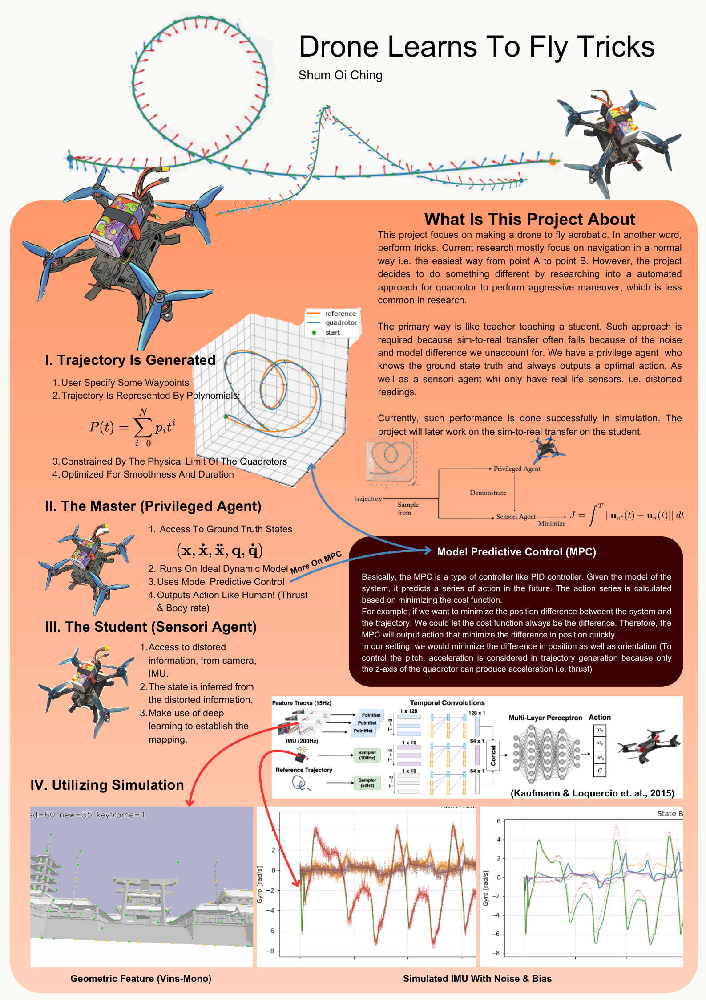
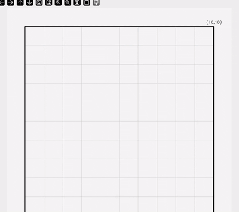

## Poster


## Installation

```sh

conda create -n drones python=3.10
conda activate drones

pip install --upgrade pip
pip install -e . # if needed, `sudo apt install build-essential` to install `gcc` and build `pybullet`

# check installed packages with `conda list`, deactivate with `conda deactivate`, remove with `conda remove -n drones --all`
```

## Demo

```sh
cd drone_fyp/gym_pybullet_drones/sensori_agent
python MPC_demo.py
```



## The Simulator is based on

[IROS 2021 paper](https://arxiv.org/abs/2103.02142) 

```bibtex
@INPROCEEDINGS{panerati2021learning,
      title={Learning to Fly---a Gym Environment with PyBullet Physics for Reinforcement Learning of Multi-agent Quadcopter Control}, 
      author={Jacopo Panerati and Hehui Zheng and SiQi Zhou and James Xu and Amanda Prorok and Angela P. Schoellig},
      booktitle={2021 IEEE/RSJ International Conference on Intelligent Robots and Systems (IROS)},
      year={2021},
      volume={},
      number={},
      pages={7512-7519},
      doi={10.1109/IROS51168.2021.9635857}
}
```

